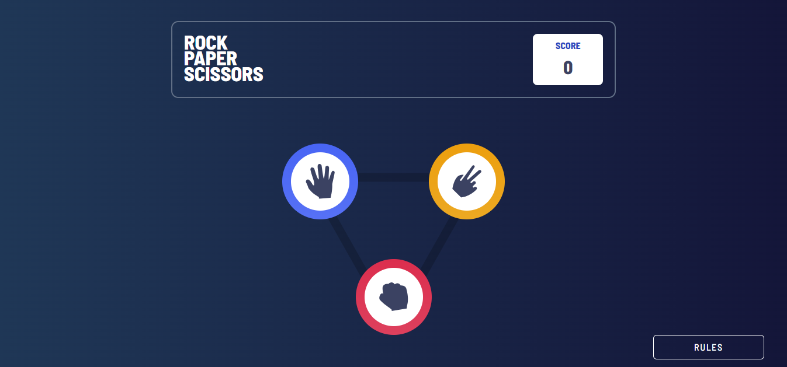

# Frontend Mentor - Rock, Paper, Scissors solution

This is a solution to the [Rock, Paper, Scissors challenge on Frontend Mentor](https://www.frontendmentor.io/challenges/rock-paper-scissors-game-pTgwgvgH). Frontend Mentor challenges help you improve your coding skills by building realistic projects.

## Table of contents

- [Overview](#overview)
  - [The challenge](#the-challenge)
  - [Screenshot](#screenshot)
  - [Links](#links)
- [My process](#my-process)
  - [Built with](#built-with)
- [Author](#author)
- [Acknowledgments](#acknowledgments)

## Overview

### The challenge

Users should be able to:

- View the optimal layout for the game depending on their device's screen size
- Play Rock, Paper, Scissors against the computer

### Screenshot

### Links

<!-- - Solution URL: [Add solution URL here](https://your-solution-url.com) -->

- Live Site URL: [Add live site URL here](https://rock-paper-scissors-havre.netlify.app/)

## My process

### Built with

- Typescript
- Tailwind
- Context API as state management
- [Headless UI](https://headlessui.com/) - UI components, designed to integrate beautifully with Tailwind CSS.
- [React](https://reactjs.org/) - JS library

## Author

- Website - [Havre Loic](https://havre.netlify.app/)
- Frontend Mentor - [@HavreLoic](https://www.frontendmentor.io/profile/HavreLoic)
